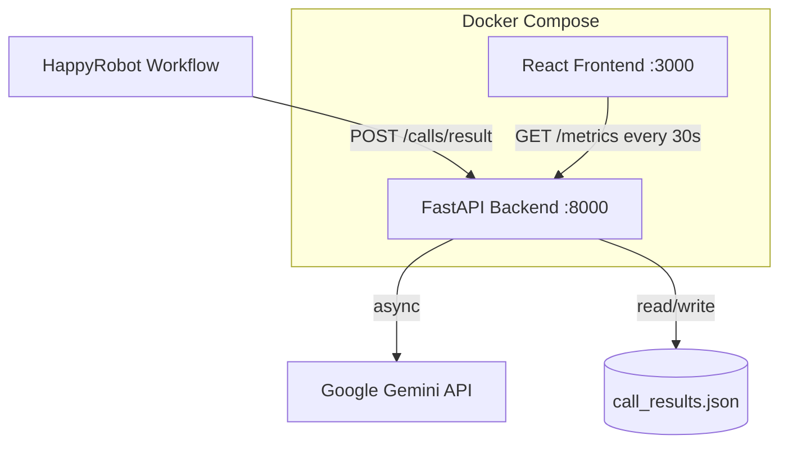

# Design Document: Dynamic Dashboard React

## Overview

This design replaces the static `index.html` vanilla-JS dashboard with a React SPA and extends the existing FastAPI backend (`main.py`) to support financial KPIs, per-call summaries, and AI-generated insights via Google Gemini.

The system has two deployable services:

- **Backend** (`main.py`) — FastAPI, extended with new fields on `CallResult`, financial KPI aggregation, and async Gemini integration.
- **Frontend** (`frontend/`) — Vite + React SPA, consuming `GET /metrics` and rendering KPI cards, charts, a calls table, and an AI insights panel.

Both services are wired together via Docker Compose and communicate over a shared Docker network. The React app talks to the backend via a configurable base URL (`VITE_API_BASE_URL`).

---

## Architecture



**Key architectural decisions:**

- **File-based persistence** is retained (JSON files in `/data`) to avoid introducing a database dependency. This matches the existing pattern in `main.py`.
- **Gemini is called on every `GET /metrics` request** when data exists. The call is async and failures are swallowed — the endpoint always returns, with `ai_insights: null` on failure.
- **React app is a Vite SPA** served by Nginx in production (Docker). In development, Vite's dev server proxies API calls to avoid CORS issues.
- **No Redux / global state library** — React's built-in `useState` + `useEffect` with a custom `useMetrics` hook is sufficient for this polling-based dashboard.

---

## Components and Interfaces

### Backend Components

#### Extended `CallResult` Model

The Pydantic model includes these optional fields. `session_id` is used as the primary call identifier/timestamp from HappyRobot:

```python
class CallResult(BaseModel):
    session_id: Optional[str] = None       # HappyRobot session ID (used as timestamp)
    mc_number: Optional[str] = None
    carrier_name: Optional[str] = None
    load_id: Optional[str] = None
    agreed_price: Optional[float] = None
    loadboard_rate: Optional[float] = None
    deal_outcome: Optional[str] = None
    customer_sentiment: Optional[str] = None
    gross_profit: Optional[float] = None
    gross_profit_margin: Optional[float] = None
    gross_loss: Optional[float] = None
    gross_loss_margin: Optional[float] = None
    call_summary: Optional[str] = None
    notes: Optional[str] = None
    transcript: Optional[str] = None
    call_duration: Optional[float] = None
    timestamp: Optional[str] = None
```

All numeric fields are sanitized on ingestion — empty strings and `"N/A"` values are coerced to `None`.

#### Updated `GET /metrics` Response Shape

```python
{
  "summary": {
    "total_calls": int,
    "success_rate_pct": float,
    "total_gross_profit": float,
    "total_gross_profit_margin": float,
    "total_gross_loss": float,
    "total_gross_loss_margin": float,
  },
  "outcomes": { str: int },
  "sentiments": { str: int },
  "calls_over_time": [{ "date": str, "count": int }],
  "recent_calls": [{ ...call fields including call_summary... }],
  "ai_insights": str | None
}
```
    "avg_gross_profit_margin": float,   # NEW
  },
  "outcomes": { str: int },
  "sentiments": { str: int },
  "calls_over_time": [{ "date": str, "count": int }],
  "recent_calls": [{ ...call fields including call_summary... }],
  "ai_insights": str | None             # NEW
}
```

### Frontend Components

```
frontend/src/
├── App.tsx                  # Root: layout, polling orchestration
├── hooks/
│   └── useMetrics.ts        # Polling hook: fetches /metrics, manages state
├── components/
│   ├── Header.tsx           # Logo, live badge, last-updated timestamp
│   ├── KpiCard.tsx          # Generic KPI card (label, value, colour accent)
│   ├── KpiGrid.tsx          # Grid of KpiCard instances
│   ├── OutcomesChart.tsx    # Doughnut chart — deal outcomes
│   ├── SentimentChart.tsx   # Bar chart — carrier sentiment
│   ├── CallsTable.tsx       # Recent calls table with call_summary column
│   └── AiInsightsPanel.tsx  # AI insights text panel
├── types/
│   └── metrics.ts           # TypeScript interfaces for API response
└── main.tsx                 # Vite entry point
```

#### `useMetrics` Hook Interface

```typescript
interface UseMetricsResult {
  data: MetricsResponse | null;
  loading: boolean;
  error: string | null;
  lastUpdated: Date | null;
  refresh: () => void;
}

function useMetrics(baseUrl: string, apiKey: string, intervalMs?: number): UseMetricsResult
```

- Default `intervalMs` = 30 000.
- On each successful fetch, updates `data` and `lastUpdated`.
- On failure, sets `error` but retains previous `data` (last-known-good).
- Cleans up the interval on unmount.

#### `KpiCard` Props

```typescript
interface KpiCardProps {
  label: string;
  value: string | number | null;
  loading: boolean;
  accentColor?: string;
  subtext?: string;
}
```

#### `CallsTable` Props

```typescript
interface CallsTableProps {
  calls: RecentCall[];
  loading: boolean;
}
```

Renders `"—"` for null `call_summary`. Shows empty-state message when `calls` is empty.

#### `AiInsightsPanel` Props

```typescript
interface AiInsightsPanelProps {
  insights: string | null;
  loading: boolean;
}
```

Shows loading skeleton while `loading`, placeholder text when `insights` is null.

---

## Data Models

### TypeScript — `types/metrics.ts`

```typescript
export interface RecentCall {
  id: string;
  session_id: string | null;
  mc_number: string | null;
  carrier_name: string | null;
  load_id: string | null;
  agreed_price: number | null;
  loadboard_rate: number | null;
  deal_outcome: string | null;
  customer_sentiment: string | null;
  call_summary: string | null;
  gross_profit: number | null;
  gross_profit_margin: number | null;
  gross_loss: number | null;
  gross_loss_margin: number | null;
  timestamp: string | null;
  received_at: string;
}

export interface MetricsSummary {
  total_calls: number;
  success_rate_pct: number;
  total_gross_profit: number;
  total_gross_profit_margin: number;
  total_gross_loss: number;
  total_gross_loss_margin: number;
}

export interface MetricsResponse {
  summary: MetricsSummary;
  outcomes: Record<string, number>;
  sentiments: Record<string, number>;
  calls_over_time: Array<{ date: string; count: number }>;
  recent_calls: RecentCall[];
  ai_insights: string | null;
}
```

### Python — Extended `CallResult` (Pydantic)

```python
class CallResult(BaseModel):
    session_id: Optional[str] = None
    mc_number: Optional[str] = None
    carrier_name: Optional[str] = None
    load_id: Optional[str] = None
    agreed_price: Optional[float] = None
    loadboard_rate: Optional[float] = None
    deal_outcome: Optional[str] = None
    customer_sentiment: Optional[str] = None
    call_summary: Optional[str] = None       # NEW
    gross_profit: Optional[float] = None     # NEW
    gross_profit_margin: Optional[float] = None  # NEW
    call_duration: Optional[float] = None
    session_id: Optional[str] = None
    transcript: Optional[str] = None
    notes: Optional[str] = None
    timestamp: Optional[str] = None
```

### Gemini Prompt Template

```
You are a logistics sales analyst. Based on the following carrier call KPIs, provide 3-5 concise, actionable insights and recommendations for the sales team.

KPIs:
- Total calls: {total_calls}
- Success rate: {success_rate_pct}%
- Total gross profit: ${total_gross_profit}
- Avg gross profit margin: {avg_gross_profit_margin}%
- Deal outcomes: {outcomes}
- Carrier sentiments: {sentiments}

Respond in plain text with bullet points. Be specific and actionable.
```

---

## Correctness Properties

*A property is a characteristic or behavior that should hold true across all valid executions of a system — essentially, a formal statement about what the system should do. Properties serve as the bridge between human-readable specifications and machine-verifiable correctness guarantees.*

**Property Reflection:** After reviewing all testable criteria, the following consolidations were made:
- 1.4 and 2.4 (auth rejection on both endpoints) are combined into one property covering any protected endpoint.
- 5.1 and 5.2 (KPI value formatting) are combined into one property covering the formatting function for any numeric KPI value.
- 6.1 and 6.2 (chart rendering for outcomes and sentiments) are combined into one property covering any categorical count dict.
- 3.1 and 3.2 (call_summary in recent_calls) are combined with 7.1 into one property covering the recent_calls response structure.
- 4.3 (Gemini failure resilience) and 5.5 (error retains last data) are kept separate as they test different layers.

---

### Property 1: Call result ingestion round-trip

*For any* valid `CallResult` payload (with any combination of optional fields present or absent), POSTing it to `/calls/result` SHALL return `success: true` with an assigned `id`, and the record SHALL subsequently appear in the `recent_calls` array of `GET /metrics` with all provided fields preserved.

**Validates: Requirements 1.1, 1.2, 1.3, 3.1, 3.2**

---

### Property 2: Protected endpoints reject invalid API keys

*For any* request to a protected endpoint (`POST /calls/result`, `GET /metrics`) made with an absent or incorrect API key, the endpoint SHALL return HTTP 403.

**Validates: Requirements 1.4, 2.4**

---

### Property 3: Financial KPI aggregation correctness

*For any* set of `CallResult` records with `gross_profit` and `gross_profit_margin` values, `GET /metrics` SHALL return `total_gross_profit` equal to the exact sum of all `gross_profit` values, and `avg_gross_profit_margin` equal to the mean of all `gross_profit_margin` values rounded to one decimal place.

**Validates: Requirements 2.1, 2.2**

---

### Property 4: Gemini failure resilience

*For any* failure mode of the Gemini API (network error, timeout, quota exceeded, unexpected exception), `GET /metrics` SHALL still return HTTP 200 with `ai_insights: null` and all other KPI fields correctly populated.

**Validates: Requirements 4.3**

---

### Property 5: KPI value formatting

*For any* numeric KPI value returned by the backend, the frontend formatting functions SHALL produce a non-empty, human-readable string — dollar-formatted for monetary values (e.g., `$1,234.56`) and percentage-formatted for margin values (e.g., `12.3%`).

**Validates: Requirements 5.1, 5.2**

---

### Property 6: Chart data completeness

*For any* categorical count dictionary (outcomes or sentiments) returned by the backend, the corresponding chart component SHALL include a data point for every key in the dictionary, including keys with a count of zero.

**Validates: Requirements 6.1, 6.2, 6.4**

---

### Property 7: Calls table renders all required columns

*For any* non-empty `recent_calls` array, the `CallsTable` component SHALL render a row for each call containing all required columns (timestamp, MC number, carrier name, load ID, loadboard rate, agreed price, deal outcome, sentiment, call summary), displaying `"—"` for any null field.

**Validates: Requirements 7.1, 7.2**

---

### Property 8: Recent calls are ordered by timestamp descending

*For any* `recent_calls` array with two or more entries, the displayed rows SHALL be ordered such that each row's timestamp is greater than or equal to the timestamp of the row below it.

**Validates: Requirements 7.4**

---

### Property 9: AI insights panel renders any non-null text

*For any* non-null `ai_insights` string returned by the backend, the `AiInsightsPanel` component SHALL render that exact text in the panel.

**Validates: Requirements 8.1**

---

### Property 10: Error state retains last known data

*For any* sequence of polling requests where at least one succeeds before a subsequent failure, the `useMetrics` hook SHALL retain the data from the last successful response and set an error indicator, without clearing the displayed values.

**Validates: Requirements 5.5, 9.3**

---

## Error Handling

### Backend

| Scenario | Behaviour |
|---|---|
| Missing / invalid `X-API-Key` | HTTP 403 `{"detail": "Invalid or missing API key"}` |
| Malformed request body | HTTP 422 (FastAPI default Pydantic validation error) |
| Gemini API exception | Log error, set `ai_insights: null`, return HTTP 200 |
| `GEMINI_API_KEY` not set | Log warning at startup; `ai_insights` always `null` |
| `call_results.json` missing | Treat as empty list; create on first write |

### Frontend

| Scenario | Behaviour |
|---|---|
| `GET /metrics` returns non-2xx | Set `error` state; retain previous `data`; show error banner |
| Network timeout / fetch throws | Same as above |
| `ai_insights: null` | Show placeholder: "AI insights unavailable" |
| `recent_calls: []` | Show empty-state message in table |
| `call_summary: null` on a row | Display `"—"` in that cell |
| Loading state | Show skeleton/spinner in KPI cards and AI panel |

---

## Testing Strategy

### Backend (Python)

**Unit tests** (`pytest`):
- `CallResult` model accepts all fields, optional fields default to `None`
- `GET /metrics` aggregation logic: `total_gross_profit`, `avg_gross_profit_margin` calculations
- `GeminiClient.generate_insights` returns `None` on exception (mock `google-generativeai`)
- `GeminiClient` skips Gemini call when no data exists
- Auth rejection returns 403 for both endpoints

**Property-based tests** (`pytest` + `hypothesis`):
- **Property 1**: `@given(call_result_strategy())` — round-trip ingestion and retrieval (min 100 runs)
- **Property 2**: `@given(invalid_api_key_strategy())` — auth rejection on both endpoints (min 100 runs)
- **Property 3**: `@given(st.lists(call_with_financials_strategy(), min_size=1))` — financial KPI aggregation correctness (min 100 runs)
- **Property 4**: `@given(gemini_failure_strategy())` — Gemini failure resilience (min 100 runs)

Each property test is tagged: `# Feature: dynamic-dashboard-react, Property N: <property_text>`

**Integration / smoke tests**:
- `GEMINI_API_KEY` absent → startup warning logged, `ai_insights: null`
- `docker compose up --build` → both services healthy (manual / CI)

### Frontend (TypeScript)

**Unit tests** (`vitest` + `@testing-library/react`):
- `KpiCard` renders loading state, value, and label correctly
- `AiInsightsPanel` renders placeholder when `insights=null`, loading state, and text
- `CallsTable` renders empty-state, `"—"` for null `call_summary`, all required columns
- `useMetrics` hook: polling interval fires, error retains last data, cleanup on unmount

**Property-based tests** (`vitest` + `fast-check`):
- **Property 5**: `fc.property(fc.float(), ...)` — KPI formatting produces valid dollar/percentage strings (min 100 runs)
- **Property 6**: `fc.property(fc.dictionary(...), ...)` — chart data completeness for any outcomes/sentiments dict (min 100 runs)
- **Property 7**: `fc.property(fc.array(recentCallArbitrary()), ...)` — table renders all columns with `"—"` for nulls (min 100 runs)
- **Property 8**: `fc.property(fc.array(recentCallArbitrary(), {minLength: 2}), ...)` — timestamp descending order (min 100 runs)
- **Property 9**: `fc.property(fc.string({minLength: 1}), ...)` — AI panel renders any non-null string (min 100 runs)
- **Property 10**: `fc.property(...)` — error state retains last known data (min 100 runs)

Each property test is tagged: `// Feature: dynamic-dashboard-react, Property N: <property_text>`

**Libraries**:
- Backend PBT: [`hypothesis`](https://hypothesis.readthedocs.io/) (Python)
- Frontend PBT: [`fast-check`](https://fast-check.dev/) (TypeScript)
